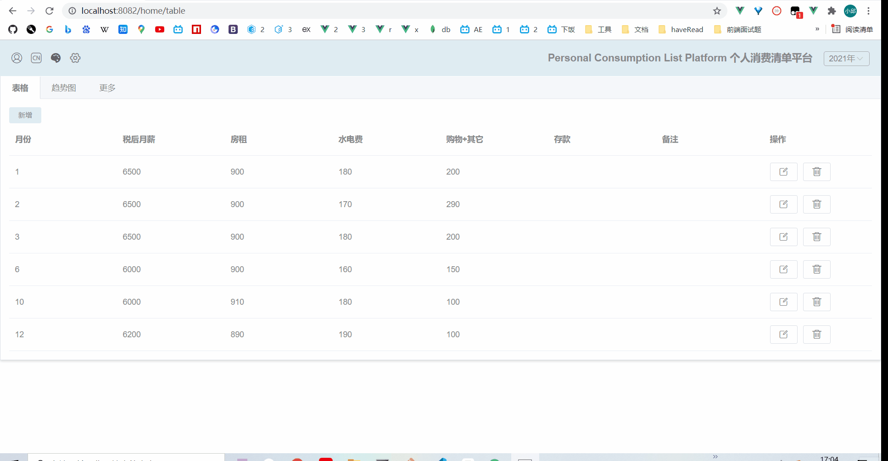
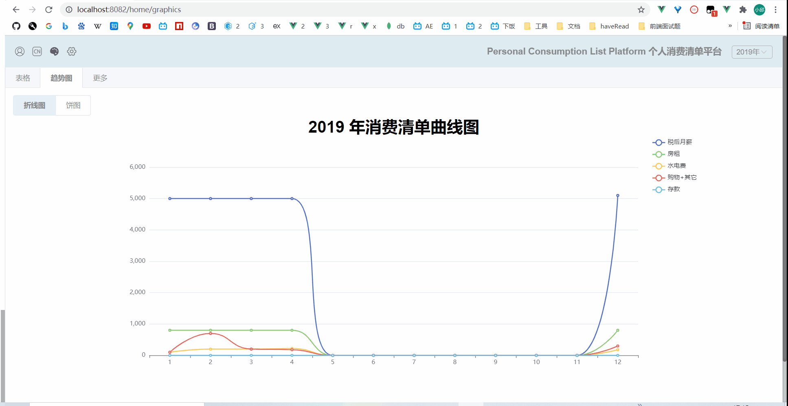
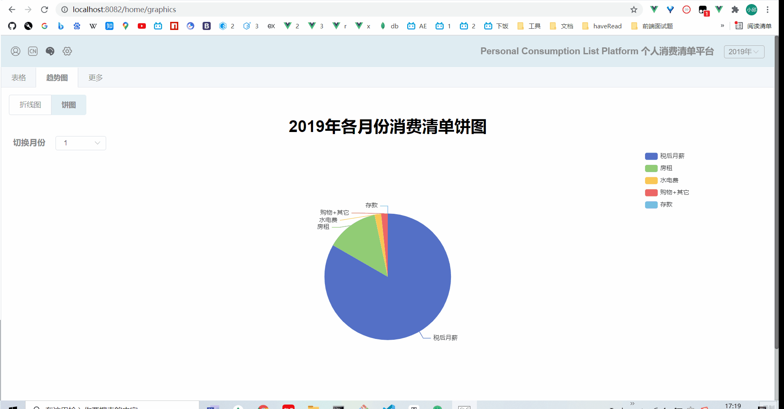

# csdd-list

**Personal consumption list platform 个人消费清单平台**

## 写在最前

自己用来记账的一个页面

预览点这：[http://39.108.224.26:1001/](http://39.108.224.26:1001/)，如果服务器挂了，可以看下面的功能演示gif图（所有gif图片文件在README.assets文件夹里），项目还在持续更新中，本README.md文档只是最初版本，中途并不会每次更新，所以一切以[http://39.108.224.26:1001/](http://39.108.224.26:1001/)的实际效果为准

## 快速启动

```
# csdd-list 根路径
npm i 
npm run serve
# server 文件夹 （记得先启用mongodb）
npm i
nodemon index.js
```

## 前端技术栈

- vue3
- vue-router
- vuex
- axios
- element-plus
- bootstrap
- echarts
- less
- vue-i18n

## 后端技术栈

- node
- express
- mongodb

## 目录结构说明

```
.
├─ README.assets                      项目演示图片资源
│    ├─ 1.gif
│    ├─ 2.gif
│    ├─ 3.gif
│    └─ 4.gif
├─ README.md
├─ package.json                       配置、依赖管理
├─ server                             
│    ├─ api.js                        服务器请求接口封装
│    ├─ db.js                         mongodb数据库封装
│    ├─ index.js                      服务器入口文件
│    ├─ jwt.js
│    └─ lists.csv                    （可导入mongodb使用）
├─ src
│    ├─ App.vue
│    ├─ assets
│    │    ├─ allCss                   views、components文件夹下的各个vue单文件对应的less样式
│    │    │    ├─ About.less
│    │    │    ├─ App.less
│    │    │    ├─ Graphics.less
│    │    │    ├─ Home.less
│    │    │    ├─ Login.less
│    │    │    └─ Table.less
│    │    ├─ bgImg.jpg
│    │    └─ iconfont
│    │           └─ ...
│    ├─ components                    子组件文件夹
│    │    ├─ Graphics.vue
│    │    ├─ More.vue
│    │    └─ Table.vue
│    ├─ i18n.js                       多语言配置
│    ├─ language                      多语言json数据
│    │    ├─ cn.json
│    │    └─ en.json
│    ├─ main.js
│    ├─ router
│    │    └─ index.js
│    ├─ store
│    │    └─ index.js
│    └─ views                         页面文件夹
│           ├─ Home.vue
│           ├─ Login.vue
│           └─ Test.vue
└─ vue.config.js                      跨域、打包等配置
```

## 功能演示

- **登录、页面展示、多语言切换**


- **（表格页）切换多语言、切换年度、新增数据、修改数据、删除数据**



- **（趋势图页-折线图）切换多语言、切换年度**



- **（趋势图页-饼图）切换多语言、切换年度、切换月份**



## 后续功能

- [ ] 多用户
- [ ] 可自定义th
- [ ] 批量导入导出

